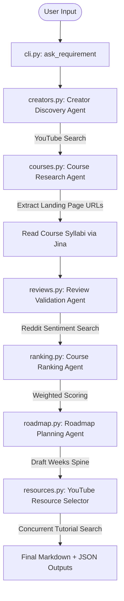

# Pathy-RoadMap-AI 🗺️🤖

A next-generation CLI tool that builds hyper-personalized, evidence-backed learning roadmaps. Give it a topic, and it will dynamically source real YouTube creators, find their actual course offerings, validate reviews from public forums, rank options using a weighted rubric, and construct a week-by-week roadmap complete with curated YouTube tutorials.

---

## 🚀 Why Pathy RoadMap AI is Better

Traditional roadmap generators usually produce generic, static outlines (e.g., "Step 1: Learn HTML, Step 2: Learn CSS"). Pathy RoadMap AI is designed with an **evidence-based agentic pipeline** that mirrors how a real human researches educational resources:

*   **Real Creator Discovery:** Instead of inventing materials, the system searches YouTube to discover actual, active content creators and educators specialized in your target topic.
*   **Zero Marketplace Spam:** It intentionally filters out generic, low-quality marketplaces (e.g., Udemy, DataCamp, Coursera) to surface creator-led cohorts, specialized bootcamps, and official landing pages.
*   **Independent Review Validation:** The pipeline runs independent searches (e.g., Reddit discussions) to verify if the courses have positive or negative student sentiment, protecting you from over-hyped marketing claims.
*   **Multi-Dimensional Rubric Ranking:** Courses are ranked using a rigorous, weighted scoring rubric (Relevance: 30%, Curriculum Depth: 20%, Independent Feedback: 20%, Creator Credibility: 15%, Recency: 10%, Value: 5%).
*   **Double-Loop Resource Selection:** The roadmap planner selects the course syllabus spine first, then concurrently searches for and maps exactly *one* highly relevant YouTube tutorial to each weekly topic to fill in the learning gaps.

---

## 🛠️ Architecture

Pathy RoadMap AI uses an agent-orchestration pipeline built on **Agno (v2.x)** equipped with a global **Prompt Injection Guardrail** to detect and reject malicious instructions in inputs:



---

## ⚙️ Setup & Installation

The project uses `uv` for fast, reproducible Python dependency management.

### 1. Prerequisites
Ensure you have Python 3.12+ and `uv` installed:
```bash
# Install uv if you don't have it
curl -LsSf https://astral.sh/uv/install.sh | sh
```

### 2. Install Dependencies
```bash
uv sync
```

### 3. Environment Configuration
Copy the template `.env.example` and fill in the required keys:
```bash
cp .env.example .env
```
Ensure your `.env` contains:
```env
OPENAI_API_KEY=your_openai_compatible_api_key
OPENAI_BASE_URL=https://api.openai.com/v1 # or your custom provider
OPENAI_MODEL_NAME=gpt-4o # or your preferred model
JINA_AI_KEY=your_jina_ai_key # Required for web search & page content parsing
```

---

## 🎮 How to Run

### Interactive Roadmap Pipeline (CLI)
Start the interactive prompt to generate a learning roadmap:
```bash
uv run python cli.py start
```

### Backend API Server (AgentOS / FastAPI)
Start the backend server on `http://localhost:7777` to expose the API and agents:
```bash
uv run python server.py
```
This serves:
* The OpenAPI docs at `http://localhost:7777/docs`
* The Direct Roadmap REST API at `POST http://localhost:7777/api/generate`
* The AgentOS WebSocket/HTTP endpoint at `http://localhost:7777` (for Agent UI chat interface)

### Frontend Agent UI
To interact with the Pathy Roadmap Assistant via a web interface, start the Next.js Agent UI:
```bash
cd agentui
bun dev # or npm run dev / pnpm dev / yarn dev
```
Open [http://localhost:3000](http://localhost:3000) in your browser and connect to `http://localhost:7777`.

### Run Tests
The codebase is equipped with unit and integration tests (using mocks to ensure 0% network or API cost during testing):
```bash
uv run pytest -v
```

---

## 📂 Output Outputs
The generated roadmaps are stored in the `output/` directory in two formats:
1.  **`roadmap_[timestamp].md`**: A beautiful, readable Markdown roadmap summarizing the recommended course, reasons for selection, and weekly schedules.
2.  **`roadmap_[timestamp].json`**: Structured JSON data containing the raw research, course metrics, and roadmap steps.
